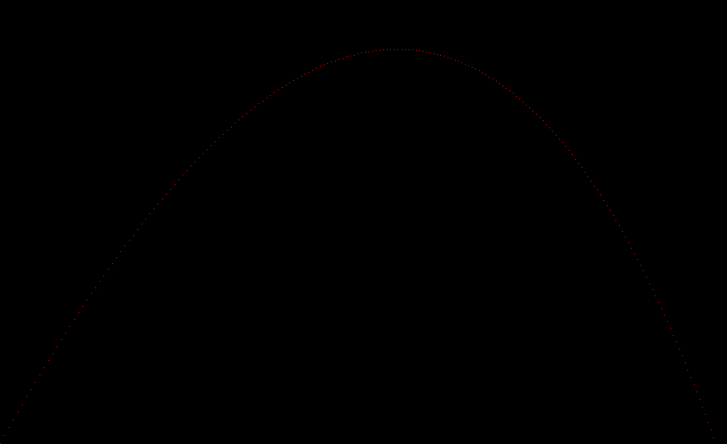
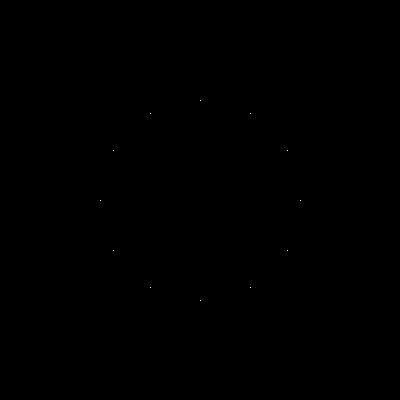
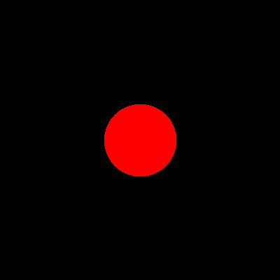
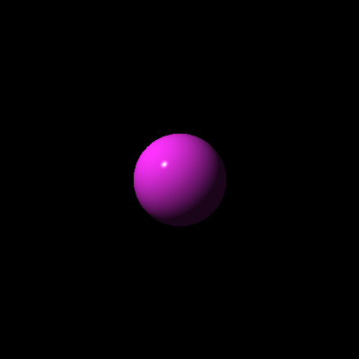
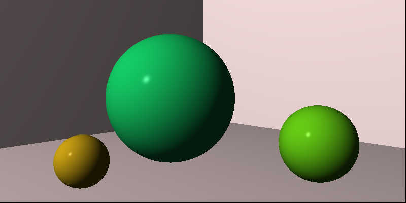
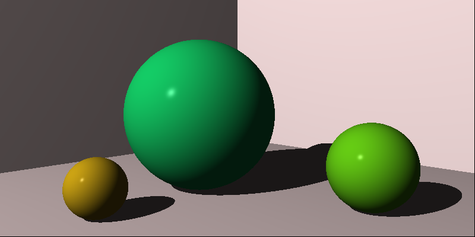
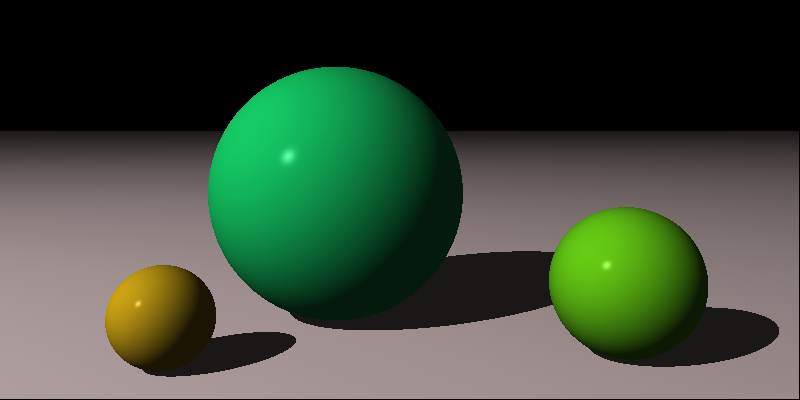
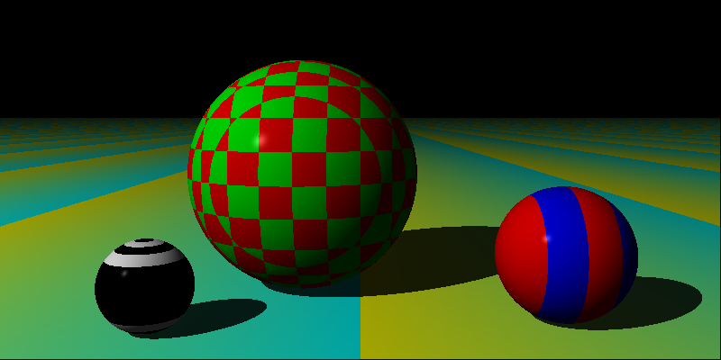
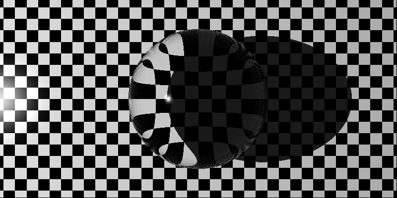
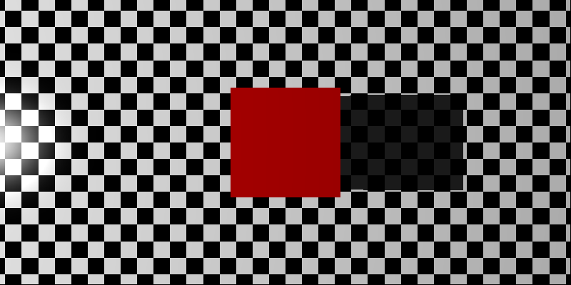

# The-Ray-Tracer-Challenge

春节期间阅读 **《The Ray Tracer Challenge》** 时用 **go** 语言写的代码，该书在oreilly在线图书馆的地址为：

https://learning.oreilly.com/library/view/the-ray-tracer/9781680506778/

官方地址：

https://pragprog.com/book/jbtracer/the-ray-tracer-challenge

这本书没有给出参考的代码，它完全要求读者自己写出代码完成挑战。它使用cucumber这个BDD（行为驱动开发）工具的Gherkin语言来提供测试案例。

在go语言中可以用godog来解析feature文件中的测试用例，但是由于自己水平有限，没弄懂godog怎么用最方便，就只用了go官方的testing包来写单元测试。

由于每次都需要先根据书中的测试样例先写测试，这些代码都是以TDD（测试驱动开发）的方式编写的。

## 目录结构说明
各章节对应的文件夹：

### 1. Tuples, Points, And Vectors

实现 Tuple 类型，Tuple 是 Point 和 Vector 的底层数据结构。w分量为1的为点，为0的为向量。

#### 对应的代码文件
- tuples
#### 对应的代码文件夹
- chapter01

### 2. Drawing On A Canvas

实现 canvas 并能输出 ppm 文件

该章最后会画出子弹发射后在风和重力作用下的运动轨迹图:

#### 对应的代码文件
- canvas
#### 对应的代码文件夹
- chapter02

## 3. Matrices

建立基础矩阵，矩阵的运算操作

#### 对应的代码文件
- matrices

## 4. Matrix Transformation

各类矩阵的变换：平移、旋转、放缩等

该章结束大作业是利用各类变换画一个表盘：

#### 对应的代码文件
- transformations
#### 对应的代码文件夹
- chapter04

## 5. Ray-Sphere Intersections

实现球、光线投射、球的相交检测等

该章结束大作业是实现最基本的球的渲染：

#### 对应的代码文件
- intersections
- objects
- rays
#### 对应的代码文件夹
- chapter05

## 6. Light And Shading

实现球的3d渲染，实现Phong光照模型

该章大作业是实现球的3d渲染：

#### 对应的代码文件
- intersections
- lights
- objects/spheres
- tuples
#### 对应的代码文件夹
- chapter06

## 7. Making A Scene

实现场景（管理光源和物体）、摄像机

该章大作业是实现对一个场景的渲染

#### 对应的代码文件
- world.go
- transformations.go
- camera.go

#### 对应的代码文件夹
- chapter07

## 8. Shadows

实现阴影

#### 对应的代码文件
- lights.go
- world.go

#### 对应的代码文件夹
- chapter08

## 9. Planes

用shape接口重构，统一表示形状
实现对平面的表示

#### 对应的代码文件
- planes.go
- shapes.go

#### 对应的代码文件夹
- chapter09

## 10. Patterns

通过Pattern接口，实现了四种图案（条纹、渐变、圆环、棋盘）

#### 对应的代码文件
- patterns.go
- lights.go

#### 对应的代码文件夹
- chapter10

## 11. Reflection And Refraction

实现反射和折射

#### 对应的代码文件
- intersections.go
- material.go
- world.go

#### 对应的代码文件夹
- chapter11

## 12. Cubes

实现正方体形状

#### 对应的代码文件
- cubes.go

#### 对应的代码文件夹
- chapter12
